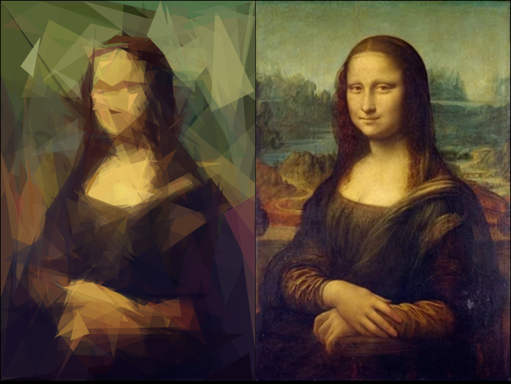

# Polygons 

This repository contains my code for a project assignment in the *Knowledge Representation and Reasoning* course at the University of Paris-Dauphine.

The challenge was about assembling randomly generated polygons together 
in order to generate the specified image. This project uses AI algorithms 
such as Hill-Climbing, Simulated Annealing, local beam search...

Polygons have random color, opacity, shape, position, saturation, brightness..

# Results

Here are some outputs of the project :

# Algorithm

These results can be obtained using a *Hill Climbing* method.
The idea is to start with a set containing a single polygon 
and iteratively do one of these actions :
* add/replace a polygon
* change the color of a polygon
* move a polygon
* change the opacity of a polygon
* move a vertex of a polygon

To enhance the quality of the outputs and reduce the number of iterations, 
several improvements have been implemented : 
* the color of a new polygon is adapted according to its position in the image,
* focus on small polygons
* polygons are sorted by "size" (perimeter : easy to calculate)

# Notes

* A genetic algorithm cannot work because of the *crossover* step 
which damage the quality of the image. Should consider some variations (there are already a lot in the Internet).
* The *Simulated Annealing* gives the same results as *Hill Climbing* with a little bit more iterations to get the same quality.
* A local beam search takes a lot of time to produce outputs because of 
the fitness calculation step (the focus of the project was on the AI algorithms, ie there is no point optimizing the fitness calculation part).

